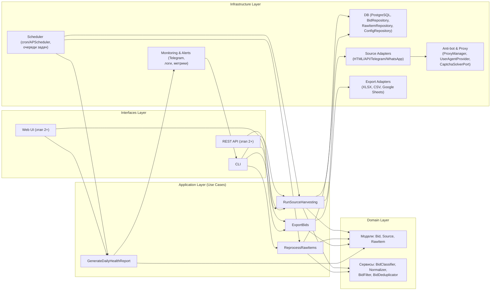
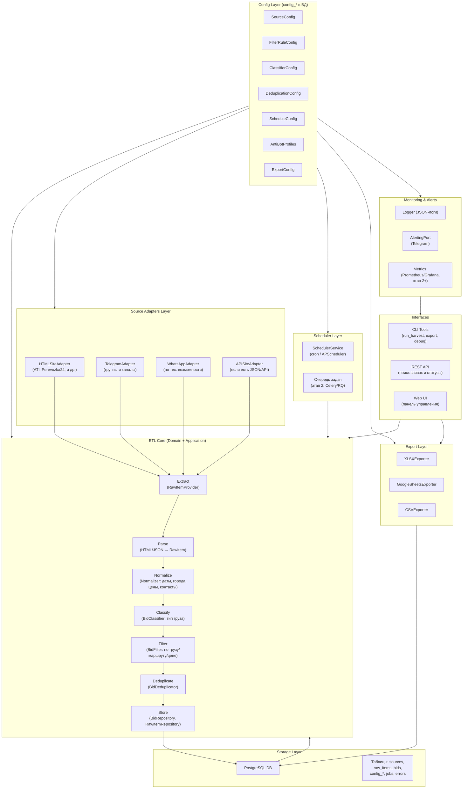
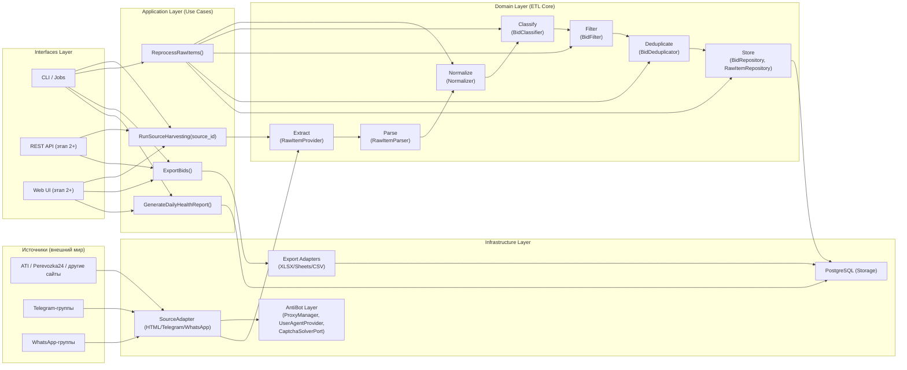
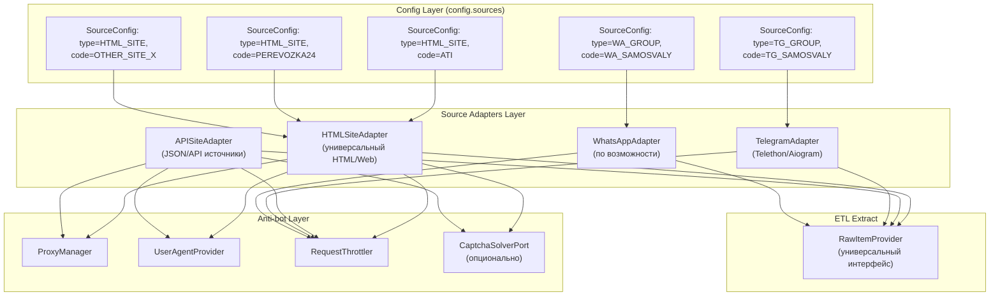

# path: docs/architecture/dan_max_diagrams.md
# Архитектурные диаграммы системы Дан-Макс (Mermaid)

## 1. Слои архитектуры (Clean Architecture / Ports & Adapters)

---

## 2. Модули системы (в разрезе архитектурных блоков)

---

## 3. ETL-потоки, привязанные к слоям и модулям

---

## 4. Карта источников и структура адаптеров

---
